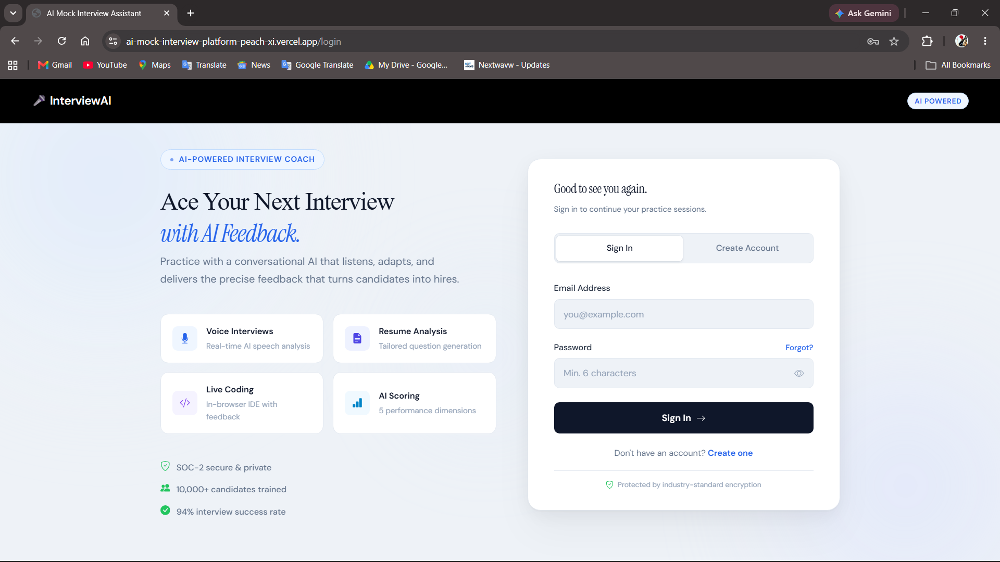
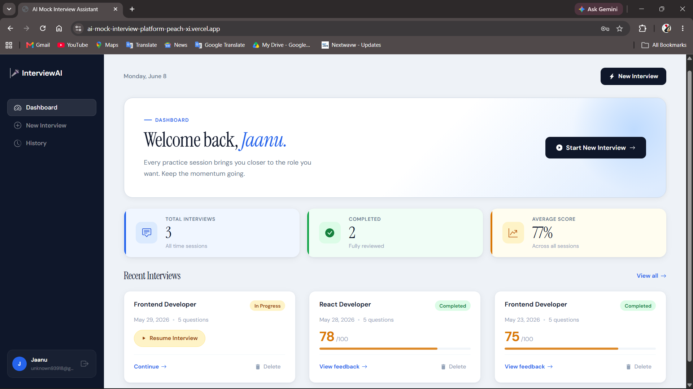
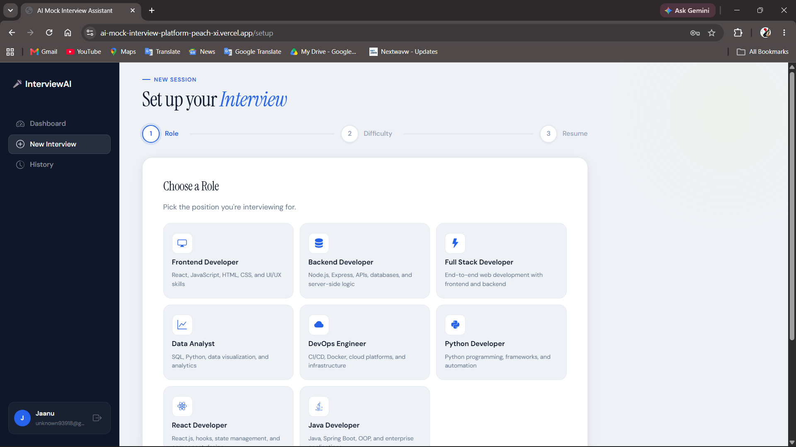
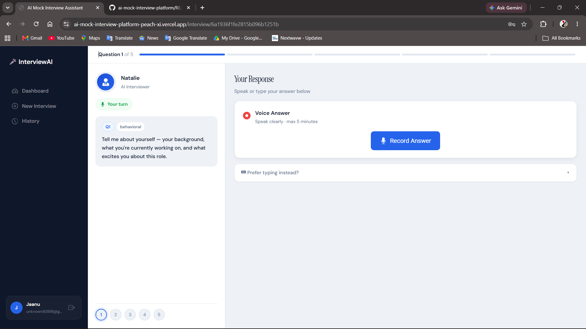
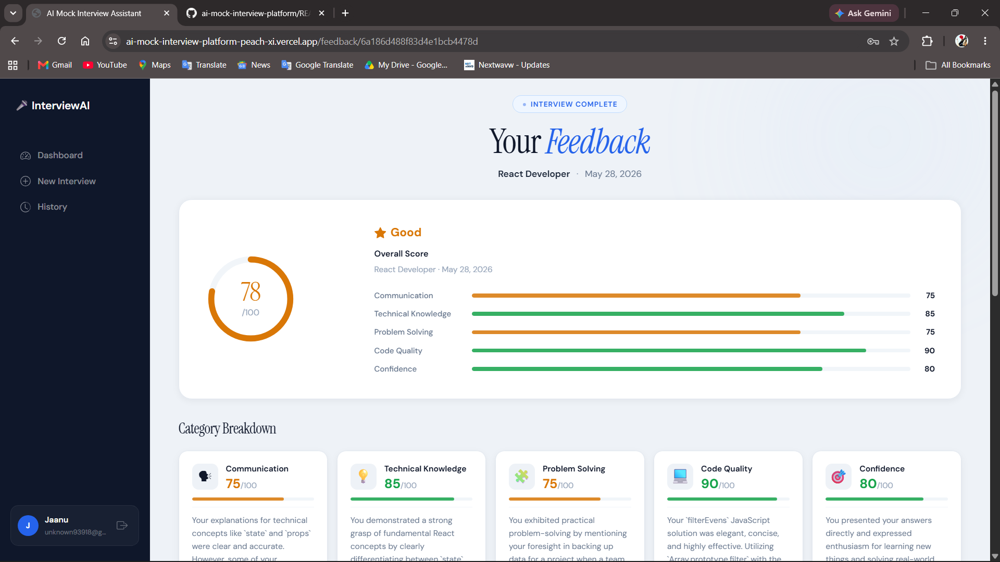
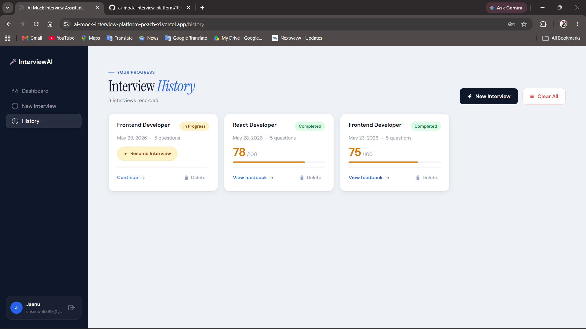

# 🎯 AI Mock Interview Platform

An AI-powered mock interview platform that helps candidates prepare for technical interviews through personalized questions, voice-based interactions, live coding challenges, and AI-generated feedback.

## 🌐 Live Demo

**Application:** https://ai-mock-interview-platform-peach-xi.vercel.app/

> Note: The backend is hosted on Render's free tier and may take up to 60 seconds to wake up after periods of inactivity.

---

## 🚀 Key Features

* 📄 Resume-based interview question generation
* 🎙️ Voice-powered mock interview experience
* 💻 Live coding challenges
* 📊 AI-generated feedback and scoring
* 📚 Interview history tracking
* 🔐 Secure JWT authentication

---

## 🛠️ Tech Stack

**Frontend:** React.js, Vite, React Router, CSS3

**Backend:** Node.js, Express.js

**Database:** MongoDB Atlas

**Authentication:** JWT (JSON Web Tokens)

**AI Services:** Google Gemini API, AssemblyAI, Murf AI

**Deployment:** Vercel, Render

**Version Control:** Git, GitHub

---

## 📂 Project Structure

```text
ai-mock-interview-platform/
│
├── client/         # React Frontend
├── server/         # Node.js Backend
├── screenshots/    # Project Screenshots
├── README.md
└── .gitignore
```

---

## 📸 Screenshots

### Login Page



### Dashboard



### Interview Setup



### Live Interview



### Feedback Report



### Interview History



---

## ⚡ Challenges Faced

* Integrating multiple AI services into a single workflow.
* Generating personalized interview questions from uploaded resumes.
* Implementing JWT-based authentication and protected routes.
* Managing voice interactions for mock interviews.
* Deploying frontend and backend services using Vercel and Render.
* Handling CORS, environment variables, and production API configuration.

---

## ⚙️ Installation

### Clone Repository

```bash
git clone https://github.com/ManishaBathini/ai-mock-interview-platform.git
cd ai-mock-interview-platform
```

### Backend Setup

```bash
cd server
npm install
npm start
```

### Frontend Setup

```bash
cd client
npm install
npm run dev
```

---

## 🔑 Environment Variables

Create a `.env` file inside the `server` directory:

```env
MONGODB_URI=your_mongodb_connection_string
JWT_SECRET=your_jwt_secret

GEMINI_API_KEY=your_gemini_api_key
ASSEMBLYAI_API_KEY=your_assemblyai_api_key
MURF_API_KEY=your_murf_api_key
```

---

## 👩‍💻 Author

**Manisha Bathini**

Aspiring Full Stack Developer passionate about building AI-powered applications and solving real-world problems.

GitHub: https://github.com/ManishaBathini
